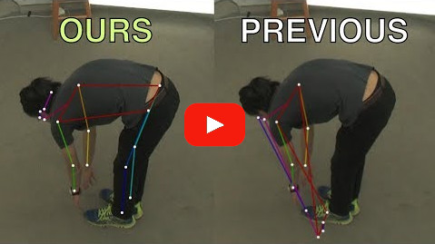
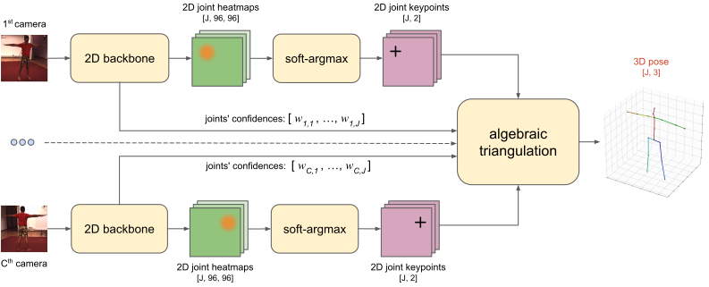
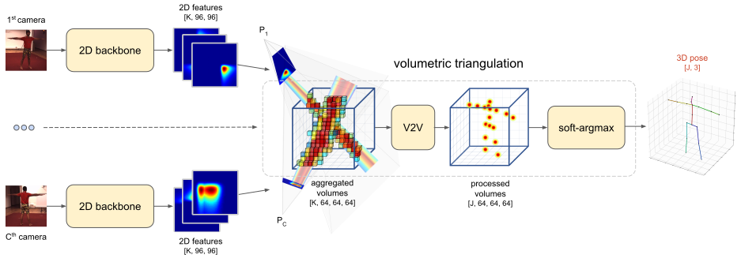

[](https://paperswithcode.com/sota/3d-human-pose-estimation-on-human36m?p=190505754)

# Learnable Triangulation of Human Pose
This repository is an official PyTorch implementation of the paper ["Learnable Triangulation of Human Pose"](https://arxiv.org/abs/1905.05754) (ICCV 2019, oral). Here we tackle the problem of 3D human pose estimation from multiple cameras. We present 2 novel methods — Algebraic and Volumetric learnable triangulation — that **outperform** previous state of the art.

If you find a bug, have a question or know to improve the code - please open an issue!

<p align="center">
  <a href="http://www.youtube.com/watch?v=z3f3aPSuhqg">
    
  </a>
</p>

# How to use
This project doesn't have any special or difficult-to-install dependencies. All installation can be down with:
```bash
pip install -r requirements.txt
```

## Data
*Note:* only [Human3.6M](http://vision.imar.ro/human3.6m/description.php) dataset training/evaluation is available right now. [CMU Panoptic](http://domedb.perception.cs.cmu.edu/) dataset will be added soon.

#### Human3.6M
1. Download and preprocess the dataset by following the instructions in [mvn/datasets/human36m_preprocessing/README.md](https://github.com/karfly/learnable-triangulation-pytorch/blob/master/mvn/datasets/human36m_preprocessing/README.md).
2. Place the preprocessed dataset to `./data/human36m`. If you don't want to store the dataset in the directory with code, just create a soft symbolic link: `ln -s {PATH_TO_HUMAN36M_DATASET}  ./data/human36m`.
3. Download pretrained backbone's weights from [here](https://drive.google.com/open?id=1TGHBfa9LsFPVS5CH6Qkcy5Jr2QsJdPEa) and place them here: `./data/pretrained/human36m/pose_resnet_4.5_pixels_human36m.pth` (ResNet-152 trained on COCO dataset and finetuned jointly on MPII and Human3.6M).
4. If you want to train Volumetric model, you need rough estimations of the 3D skeleton both for train and val splits. In the paper we estimate 3D skeletons via Algebraic model. You can use [pretrained](#model-zoo) Algebraic model to produce predictions or just take [precalculated 3D skeletons](#model-zoo).

## Model zoo
In this section we collect pretrained models and configs. All **pretrained weights** and **precalculated 3D skeletons** can be downloaded from [Google Drive](https://drive.google.com/open?id=1TGHBfa9LsFPVS5CH6Qkcy5Jr2QsJdPEa) and placed to `./data` dir, so that eval configs can work out-of-the-box (without additional setting of paths).

**Human3.6M:**

| Model                | Train config                                                                                                                                                                            | Eval config                                                                                                                                                                           | Weights                                                                                    | Precalculated results                                                  | MPJPE (relative to pelvis), mm |
|----------------------|:---------------------------------------------------------------------------------------------------------------------------------------------------------------------------------------|:-------------------------------------------------------------------------------------------------------------------------------------------------------------------------------------|:------------------------------------------------------------------------------------------:|:--------------------------------------------------------------------------------------------:|-------------------------------:|
| Algebraic            |         [train/human36m_alg.yaml](https://github.com/karfly/learnable-triangulation-pytorch/blob/master/experiments/human36m/train/human36m_alg.yaml)         |         [eval/human36m_alg.yaml](https://github.com/karfly/learnable-triangulation-pytorch/blob/master/experiments/human36m/eval/human36m_alg.yaml)         | [link](https://drive.google.com/file/d/1HAqMwH94kCfTs9jUHiuCB7vt94rMvxWe/view?usp=sharing) | [link](https://drive.google.com/drive/folders/1LCzMQswdn4UM9fbRYOZb3FmMZ7pZFyIP?usp=sharing) | 22.4                           |
| Volumetric (softmax) | [train/human36m_vol_softmax.yaml](https://github.com/karfly/learnable-triangulation-pytorch/blob/master/experiments/human36m/train/human36m_vol_softmax.yaml) | [eval/human36m_vol_softmax.yaml](https://github.com/karfly/learnable-triangulation-pytorch/blob/master/experiments/human36m/eval/human36m_vol_softmax.yaml) | [link](https://drive.google.com/file/d/1r6Ut3oMKPxhyxRh3PZ05taaXwekhJWqj/view?usp=sharing) |                                               —                                              | **20.5**                       |
## Train
Every experiment is defined by `.config` files. Configs with experiments from the paper can be found in the `./experiments` directory (see [model zoo](#model-zoo)).

#### Single-GPU
To train a Volumetric model with softmax aggregation using **1 GPU**, run:
```bash
python3 train.py \
  --config train/human36m_vol_softmax.yaml \
  --logdir ./logs
```

The training will start with the config file specified by `--config`, and logs (including tensorboard files) will be stored in `--logdir`.

#### Multi-GPU (*in testing*)
Multi-GPU training is implemented with PyTorch's [DistributedDataParallel](https://pytorch.org/docs/stable/nn.html#distributeddataparallel). It can be used both for single-machine and multi-machine (cluster) training. To run the processes use the PyTorch [launch utility](https://github.com/pytorch/pytorch/blob/master/torch/distributed/launch.py).

To train a Volumetric model with softmax aggregation using **2 GPUs on single machine**, run:
```bash
python3 -m torch.distributed.launch --nproc_per_node=2 --master_port=2345 \
  train.py  \
  --config train/human36m_vol_softmax.yaml \
  --logdir ./logs
```

## Tensorboard
To watch your experiments' progress, run tensorboard:
```bash
tensorboard --logdir ./logs
```

## Evaluation
After training, you can evaluate the model. Inside the same config file, add path to the learned weights (they are dumped to `logs` dir during training):
```yaml
model:
    init_weights: true
    checkpoint: {PATH_TO_WEIGHTS}
```

Also, you can change other config parameters like `retain_every_n_frames_test`.

Run:
```bash
python3 train.py \
  --eval --eval_dataset val \
  --config eval/human36m_vol_softmax.yaml \
  --logdir ./logs
```
Argument `--eval_dataset` can be `val` or `train`. Results can be seen in `logs` directory or in the tensorboard.

# Results
* We conduct experiments on two available large multi-view datasets: Human3.6M [\[2\]](#references) and CMU Panoptic [\[3\]](#references).
* The main metric is **MPJPE** (Mean Per Joint Position Error) which is L2 distance averaged over all joints.

## Human3.6M
* We significantly improved upon the previous state of the art (error is measured relative to pelvis, without alignment).
* Our best model reaches **17.7 mm** error in absolute coordinates, which was unattainable before.
* Our Volumetric model is able to estimate 3D human pose using **any number of cameras**, even using **only 1 camera**. In single-view setup, we get results comparable to current state of the art [\[6\]](#references) (49.9 mm vs. 49.6 mm).

<br>
MPJPE relative to pelvis:

|                             	|  MPJPE (averaged across all actions), mm	|
|-----------------------------	|:--------:	|
| Multi-View Martinez [\[4\]](#references)          |   57.0   	|
| Pavlakos et al. [\[8\]](#references)   	          |   56.9   	|
| Tome et al. [\[4\]](#references)                 	|   52.8   	|
| Kadkhodamohammadi & Padoy [\[5\]](#references)   	|   49.1   	|
| [Qiu et al.](https://github.com/microsoft/multiview-human-pose-estimation-pytorch) [\[9\]](#references)   	|   26.2   	|
| RANSAC (our implementation) 	|   27.4   	|
| **Ours, algebraic**          	|   22.4   	|
| **Ours, volumetric**         	| **20.5** 	|

<br>
MPJPE absolute (scenes with invalid ground-truth annotations are excluded):

|                             	|  MPJPE (averaged across all actions), mm 	|
|-----------------------------	|:--------:	|
| RANSAC (our implementation) 	|   22.8   	|
| **Ours, algebraic**          	|   19.2   	|
| **Ours, volumetric**         	| **17.7** 	|

<br>
MPJPE relative to pelvis (single-view methods):

|                             	| MPJPE (averaged across all actions), mm 	|
|-----------------------------	|:-----------------------------------:	|
| Martinez et al. [\[7\]](#references)                  	|                 62.9               	|
| Sun et al. [\[6\]](#references)                  	|                 **49.6**                	|
| **Ours, volumetric single view** 	|                 **49.9**                	|


## CMU Panoptic
* Our best model reaches **13.7 mm** error in absolute coordinates for 4 cameras
* We managed to get much smoother and more accurate 3D pose annotations compared to dataset annotations (see [video demonstration](http://www.youtube.com/watch?v=z3f3aPSuhqg))

<br>
MPJPE relative to pelvis [4 cameras]:

|                             	|  MPJPE, mm 	|
|-----------------------------	|:--------:	|
| RANSAC (our implementation) 	|   39.5   	|
| **Ours, algebraic**          	|   21.3   	|
| **Ours, volumetric**         	| **13.7** 	|

# Method overview
We present 2 novel methods of learnable triangulation: Algebraic and Volumetric.

## Algebraic


Our first method is based on Algebraic triangulation. It is similar to the previous approaches, but differs in 2 critical aspects:
1. It is **fully differentiable**. To achieve this, we use soft-argmax aggregation and triangulate keypoints via a differentiable SVD.
2. The neural network additionally predicts **scalar confidences for each joint**, passed to the triangulation module, which successfully deals with outliers and occluded joints.

For the most popular Human3.6M dataset, this method already dramatically reduces error by **2.2 times (!)**, compared to the previous art.


## Volumetric


In Volumetric triangulation model, intermediate 2D feature maps are densely unprojected to the volumetric cube and then processed with a 3D-convolutional neural network. Unprojection operation allows **dense aggregation from multiple views** and the 3D-convolutional neural network is able to model **implicit human pose prior**.

Volumetric triangulation additionally improves accuracy, drastically reducing the previous state-of-the-art error by **2.4 times!** Even compared to the best parallelly developed [method](https://github.com/microsoft/multiview-human-pose-estimation-pytorch) by MSRA group, our method still offers significantly lower error of **21 mm**.

<p align="center">
  
</p>


# Cite us!
```bibtex
@inproceedings{iskakov2019learnable,
  title={Learnable Triangulation of Human Pose},
  author={Iskakov, Karim and Burkov, Egor and Lempitsky, Victor and Malkov, Yury},
  booktitle = {International Conference on Computer Vision (ICCV)},
  year={2019}
}
```

# Contributors
 - [Karim Iskakov](https://github.com/karfly)
 - [Egor Burkov](https://github.com/shrubb)
 - [Victor Lempitsky](https://scholar.google.com/citations?user=gYYVokYAAAAJ&hl=ru)
 - [Yury Malkov](https://github.com/yurymalkov)
 - [Rasul Kerimov](https://github.com/rrkarim)
 - [Ivan Bulygin](https://github.com/blufzzz)

# News
**18 Oct 2019:** Pretrained models (algebraic and volumetric) for Human3.6M are released.
**8 Oct 2019:** Code is released!

# References
* [\[1\]](#references) R. Hartley and A. Zisserman. **Multiple view geometry in computer vision**.
* [\[2\]](#references) C. Ionescu, D. Papava, V. Olaru, and C. Sminchisescu. **Human3.6m: Large scale datasets and predictive methods for 3d human sensing in natural environments**.
* [\[3\]](#references) H. Joo, T. Simon, X. Li, H. Liu, L. Tan, L. Gui, S. Banerjee, T.  S. Godisart, B. Nabbe, I. Matthews, T. Kanade,S. Nobuhara, and Y. Sheikh. **Panoptic studio: A massively multiview system for social interaction capture**.
* [\[4\]](#references) D. Tome, M. Toso, L. Agapito, and C. Russell.  **Rethinking Pose in 3D: Multi-stage Refinement and Recovery for Markerless Motion Capture**.
* [\[5\]](#references) A. Kadkhodamohammadi and N. Padoy. **A generalizable approach for multi-view 3D human pose regression**.
* [\[6\]](#references) X. Sun, B. Xiao, S. Liang, and Y. Wei. **Integral human pose regression**.
* [\[7\]](#references) J. Martinez, R. Hossain, J. Romero, and J. J. Little. **A simple yet effective baseline for 3d human pose estimation**.
* [\[8\]](#references) G. Pavlakos, X. Zhou, K. G. Derpanis, and  K. Daniilidis. **Harvesting multiple views for marker-less 3D human pose annotations**.
* [\[9\]](#references) H. Qiu, C. Wang, J. Wang, N. Wang and W. Zeng. (2019). **Cross View Fusion for 3D Human Pose Estimation**, [GitHub](https://github.com/microsoft/multiview-human-pose-estimation-pytorch)
